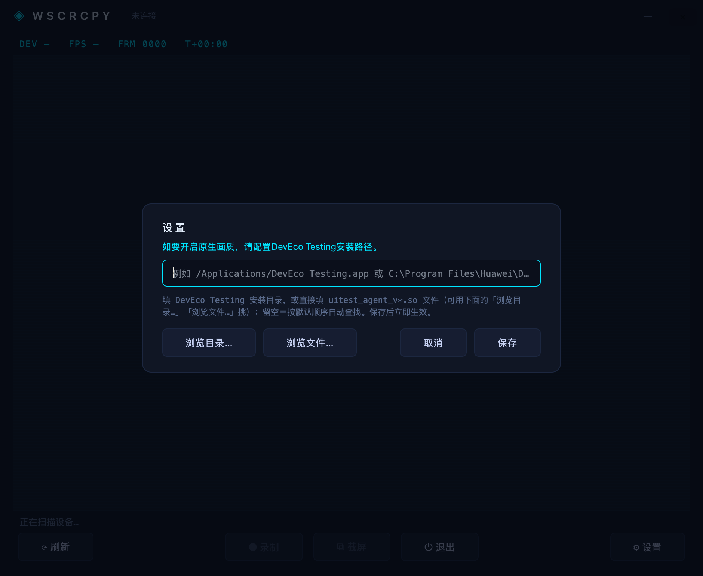

# Wscrcpy —— HarmonyOS NEXT 手表/手机投屏 / 录屏 / 截图

双击即用的桌面应用：**macOS `Wscrcpy.app` / Windows `Wscrcpy.exe`**，深色控制台风格 GUI
（PySide6），窗口内按钮直接【录制】【截屏】。**目标机零配置**——Python/Qt/Pillow/hdc/ffmpeg
全部内置，不装 DevEco、不装 ffmpeg、不配 PATH。

三条采集通道（`auto` 依次尝试、逐档自动降级）：

| 通道 | 机制 | 实测帧率 |
|---|---|---|
| `stream` | uitest + scrcpy server 虚拟屏 H.264 → gRPC | 手机 30 fps+；手表虚拟屏零帧，不可用 |
| `agent` | uitest `agent.so` 变化触发 JPEG 推流 | 手表 **1.3~30.8 fps**（= 画面变化率，`scale 0.5` → 233²） |
| `pull` | PC 逐帧 `snapshot_display` 截图 | 手机 1.6 fps / 手表 0.6 fps |

设计文档见 [PLAN.md](PLAN.md)（第 12 节为 agent 通道）；
agent 协议逆向全过程见 [research/agent.so协议逆向.md](research/agent.so协议逆向.md)。

## 使用（最终用户）

1. 双击 `Wscrcpy.app`（macOS 首次右键 → 打开）或 `dist\Wscrcpy\Wscrcpy.exe`（Windows）——
   **无设备也能启动**，窗口会显示"未发现设备"占位提示；
2. 设备开启开发者模式 + USB 调试并授权，数据线连接电脑，点窗口里的 `⟳ 刷新`（或 Ctrl+R）
   自动连接并开始投屏；
3. 窗口内：`● 录制` 开始/停止（保存对话框默认桌面/图片目录）、`⧉ 截屏`（**自动复制到
   系统剪贴板**，可直接 ⌘V/Ctrl+V 粘贴；保存文件可选）、`◐ 画质`（agent 推流分辨率档位：
   原生 0.99 / 清晰 0.8 / 流畅 0.5，点击即切换并重启采集）、`⏻ 退出`、最右侧
   `⚙ 设置`（配置 DevEco Testing 安装路径，用来开启原生画质）；
   快捷键 `R` / `S` / `Ctrl+Q` 同效；
4. 投屏中拔线/掉线会自动回到"未连接"状态，重连后点 `⟳ 刷新` 即可；
5. 录制完成自动合成 mp4 并清理中间帧，不在磁盘堆积垃圾数据。

默认 `auto` 档：手机走 H.264 视频流（30 fps+），手表走 agent 推流
（**帧率等于画面变化率**：连续滚动实测 30.8 fps，表盘动画 ~1.3 fps，静态页面 0 fps）；
两者都不可用时才降级到 `snapshot_display` 逐帧截图（手表约 0.6 fps）。
隐私页会显示黑帧标记，属预期。

> **agent 通道需要华为的 `uitest_agent_v1.2.2.so`**。因版权原因本仓库**不内置**该 so，
> 程序会从多条路径自动查找（详见下节「原生画质 / agent.so 从哪里找」），也可以在界面
> `⚙ 设置` 里指定 DevEco Testing 安装路径，或用 `--agent-so` / 环境变量 `WSCRCPY_AGENT_SO`
> 指定 so 文件或 DevEco Testing 目录。找不到时会跳过该档，只跑其它两档。
> 注意该通道是**变化触发**：手表画面静止时不推帧，程序会用 1 s 心跳维持时间轴（录制不受影响）。

## 从源码构建（开发者）

```bash
pip install -r requirements.txt   # PySide6 / Pillow / pyinstaller
./build.sh                        # macOS → dist/Wscrcpy.app（hdc/ffmpeg 取本机最新 SDK）
./build.ps1                       # Windows → dist/Wscrcpy/（自动下载 ffmpeg，hdc.exe 需 -HdcBin）
```

构建机需要：Python 3.10+、本机一份 hdc（DevEco Command Line Tools）、ffmpeg
（`brew install ffmpeg` / gyan.dev）。CI 见 `.github/workflows/build.yml`。

产物：`dist/Wscrcpy.app`（应用本体）+ `Wscrcpy-macOS.dmg`（拖拽安装包）。
不做 DMG 时也可直接分发 app 本体：

```bash
ditto -c -k --sequesterRsrc --keepParent dist/Wscrcpy.app dist/Wscrcpy-macOS-app.zip
```

构建后想确认包内资源是否就位（**不需要设备**）：`dist/Wscrcpy.app/Contents/MacOS/Wscrcpy --selfcheck`。

### 构建 Windows 版（无需 Windows 机器）

PyInstaller **不支持交叉编译**，exe 必须在 Windows 环境产出，两条路径：

- **GitHub Actions 云构建（推荐，无需 Windows 机器）**：
  1. 取一份 Windows 版 `hdc.exe`（华为开发者站下载 Windows 版 Command Line Tools 解压即得），
     放到 `vendor/bin/hdc.exe` 并提交（ffmpeg 由 CI 自动下载，无需提供）；
  2. `git init && git add -A && git commit && git push`（推到 GitHub，公开仓库免费）；
  3. 仓库 Actions 页 → **build** → Run workflow → 下载 `Wscrcpy-Windows` artifact，
   解压即用。
- **本地 Windows / 虚拟机**：拷贝项目 → `.\build.ps1 -HdcBin <hdc.exe路径>` → `dist\Wscrcpy\Wscrcpy.exe`。

Wine 跑 Windows Python 的交叉构建方案在 Apple Silicon 上为双层模拟、PySide6 体积巨大，
可行性极低，未采用。

## CLI 高级用法

```bash
python3 wscrcpy.py --probe            # 真机验证清单（连通/类型/单帧/唤醒/sh/agent 通道）
python3 wscrcpy.py --selfcheck        # 资源自检：hdc/ffmpeg/agent.so 从哪来（不需要设备）
python3 wscrcpy.py --record out.mp4   # 打开 GUI 并立即开始录制
python3 wscrcpy.py --shot out.jpeg    # 单帧截图后退出（纯 CLI）
python3 wscrcpy.py --mode auto        # 默认: stream → agent → pull 逐档降级
python3 wscrcpy.py --mode agent       # 强制 agent 推流（uitest agent.so）
python3 wscrcpy.py --mode pull        # 强制逐帧截图（最稳、最慢）
python3 wscrcpy.py --agent-scale 0.5  # agent 推流缩放比，必须 <1.0（默认 0.99≈原生 462×462）
python3 wscrcpy.py --agent-so PATH    # PATH 可为 .so 文件，也可为 DevEco Testing 安装目录
python3 wscrcpy.py --serial XXX       # 多设备时指定
```

`--agent-so` 与 `WSCRCPY_AGENT_SO` 都接受**两种**写法：

```bash
# ① 直接给 so 文件
python3 wscrcpy.py --agent-so /path/to/uitest_agent_v1.2.2.so
# ② 给 DevEco Testing 的安装路径（程序在它下面找 so；版本/架构自动按设备挑）
python3 wscrcpy.py --agent-so "/Applications/DevEco Testing.app"
python3 wscrcpy.py --agent-so "C:\Program Files\Huawei\DevEco Testing"
```

打包后的 `.app` 也支持这两个只读命令，例如：

```bash
dist/Wscrcpy.app/Contents/MacOS/Wscrcpy --selfcheck   # 确认包内 hdc/ffmpeg 就位
dist/Wscrcpy.app/Contents/MacOS/Wscrcpy --probe       # 接上设备跑验证清单
```

## 自检与回归测试

```bash
python3 wscrcpy.py --selfcheck           # 本机资源/so 定位（不需要设备）
python3 tests/test_so_resolve.py         # so 多路径解析回归（不需要设备）
python3 tests/test_gui_settings.py       # 界面「设置」浮层回归（离屏渲染，不需要设备）
```

## 项目结构

```
wscrcpy.py                 # CLI/GUI 入口
wscrcpy.spec               # PyInstaller 打包配置（双平台同源）
build.sh / build.ps1       # macOS / Windows 一键构建
scripts/caploop.sh         # 设备端后台连拍脚本（实验性）
watchscrcpy/
  ├── gui.py               # PySide6 深色控制台窗口（采集回落链）
  ├── hdc.py               # hdc 封装：竞态安全截屏、命令降级、日志噪声清洗
  ├── agent.py             # uitest agent.so 推流通道（协议分帧 / 变化触发推流 / 心跳）
  ├── capture.py           # 拉帧管线（pull / loop 双模式，投屏录制共享）
  ├── recorder.py          # 录制：帧落盘 + ffconcat VFR 合成（后台线程）
  └── resources.py         # 跨平台资源定位 / hdc·ffmpeg 查找链 / 日志·配置目录
research/                  # 官方实现与 agent.so 协议逆向记录
vendor/                    # 构建素材（hdc、ffmpeg、caploop.sh），build 脚本自动备齐
```

## 已知限制

- **清晰度**：投屏/录制的像素上限 = **设备屏幕本身**（手表 HUAWEI NIZ-AL00 实测
  `snapshot_display` 原生 **466×466**，agent 推流取 `scale=0.99` → **462×462**）。
  放到大屏全屏看会觉得软，这是屏幕分辨率的物理上限，不是采样丢的。HUD 里的
  `FRM 0123 462×462` 就是当前**采集侧真实分辨率**：它若显示 233×233，说明画质档被调到了
  「流畅」，点 `◐ 画质` 回到「原生」即可（agent 通道帧率由画面变化率决定，**降分辨率
  并不能换帧率**）。
- **帧率**：`stream`（手机）30 fps+；`agent`（手表）**等于画面变化率** —— 连续滚动实测
  30.8 fps、表盘动画 ~1.3 fps、静态页面 0 fps，配合 1 s 心跳把下限抬到 ~1 fps；
  只有降级到 `pull` 时才受截图机制限制（**手机 1.6 fps / 手表 0.6~0.7 fps**，
  手表 `snapshot_display` 单帧 1.44 s）。触控回注、音频未实现（见 PLAN.md M5+）。
- **agent 通道需自备 `uitest_agent.so`**（华为版权，不随包分发）：缺失时自动跳过该档
  （从哪里找见「原生画质 / agent.so 从哪里找」；界面 `⚙ 设置` 里也能直接配）。
  该通道**变化触发**，静止画面靠 1 s 心跳维持时间轴；首帧需 9~22 s（推 so + 起 daemon + 握手）。
- **`hdc fport rm` 在部分设备/工具链上失效**（报 `ruler is not exist`）：反复连接会留下
  可连但不通的残留转发，需 `hdc kill && hdc start` 清理；程序用固定端口 + 自动换端口规避。
- macOS 未签名应用首次运行需右键 → 打开；Windows 自签名/无签名会过 SmartScreen 提示。
- 手机已真机全链路验证（见 PLAN.md 第 6 节）；**手表已真机全链路验证**
  （HUAWEI NIZ-AL00 / HarmonyOS 7.0.0.109，见 PLAN.md 第 11、12 节）：agent 推流 30.8 fps、
  录制/GUI/圆遮罩全部通过；因手表虚拟屏不产出帧，H.264 流畅模式在手表上不可用，
  自动降到 agent 档（**不再是** 0.6 fps 的截图档）。
- agent 通道仅在 arm64 手表 + uitest 7.0.0.1 上实测；x86_64 / 旧 uitest 未实机验证。

## 关于 hdc 的版本耦合（重要）

程序内置了 hdc，运行时**不需要**安装 DevEco Studio；但 hdc 是与手机端 daemon 配对的
"驱动级"组件——**手机系统升级会抬高 hdc 最低协议版本**，封存在包内的 hdc 快照可能变旧。
典型症状：设备能列出但所有 shell 命令报
`E000001: The sdk hdc.exe version is too low`（[官方 HDC 文档](https://developer.huawei.com/consumer/cn/doc/harmonyos-guides/hdc)）。

应对：本工具会自动检测 E000001 并明确提示；修复方式 = 用新版 hdc **重新构建**
（`./build.sh` 会自动选取本机最新的 SDK hdc，优先级：OpenHarmony Sdk → hmscore →
DevEco Studio 内置），开发态亦同序自动探测。也可用 `--hdc-path` 临时指定。
另外注意：部分旧版工具链目录含 `HdcExternal`（1.0.6 外部模式 server），会抢占 5037
端口且被新手机拒绝；本工具打包时刻意不携带它，排查端口冲突可先
`lsof -iTCP:5037` 查看 server 归属。

## 连不上设备 / 一直显示「正在扫描设备…」怎么办

**先说清设备是怎么被找到的**：程序不做任何广播/发现协议 —— 它就是把内置的 hdc 当命令行跑
一次 `hdc list targets`，取每行**第一列**作为序列号（跳过 `[Empty]` 和混入 stdout 的
`[W]/[E]/[F]` 日志行）；拿到序列号后再用 `hdc -t <sn> shell param get
const.product.devicetype` 判断机型（手表/手机走不同回落链）。所以
**「程序能不能看到设备」严格等价于「用同一个 hdc 在终端跑 `hdc list targets` 有没有输出」**。

先分清是**设备侧**还是**程序侧**：在终端跑一次 `hdc list targets`（用程序内置的那个：
macOS 是 `Wscrcpy.app/Contents/Frameworks/bin/hdc`）。

1. **终端也看不到**（输出 `[Empty]`）→ 设备侧问题，按顺序排查：
   - 换线/换口重插，点亮手表屏幕，确认弹出的是否允许调试已点「允许」；
   - `hdc kill && hdc start` 重启本机 hdc 服务（能清掉失效的端口转发与僵死会话）；
   - 注意**两个 hdc 版本会各起一套服务**（新版 `tcp:8710`、旧版 `tcp:5037`），
     用 `lsof -nP -iTCP | grep -E '5037|8710'` 看你连的是哪一套。
2. **终端看得到、程序看不到** → 用 `--hdc-path` 指向你刚验证过的那个 hdc 再启动。
3. **卡在 loading 不动**：扫描有 20 s 超时并自动重试一次，期间状态栏会显示「正在重试…」；
   万一连上后迟迟没画面，**45 s 后会自动把「⟳ 刷新」放回来**，点它重试即可，不必强杀进程。
4. 需要进一步定位时看日志：`~/Library/Logs/wscrcpy.log`（不可写时自动退到系统临时目录下的
   `wscrcpy.log`，再不行只打 stderr）。关键行：`connected: <序列号> dtype=...`（连上谁、什么类型）、
   `agent 推流尺寸 462x462（设备显示 466x466，scale=...）`（**清晰度问题第一现场**）、
   `mode 模式启动失败，尝试下一档: ...`（回落原因）、`list targets 超时`（hdc 无响应）。

## 原生画质 / agent.so 从哪里找

原生画质（agent 通道）要华为自带的 `uitest_agent_v*.so`（在 **DevEco Testing** 里，
本仓库因版权不内置）。程序可以从**多条路径**找到它——本程序装在哪个目录都不影响。

**查找顺序**（前一条有结果就不再往下找）：

| # | 来源 | 说明 |
|---|------|------|
| 1 | `--agent-so <路径>` | 命令行显式指定，优先级最高 |
| 2 | 环境变量 `WSCRCPY_AGENT_SO` | 同上，适合做启动脚本/快捷方式 |
| 3 | 界面 `⚙ 设置` 里配置的路径 | 写进配置文件，长期生效 |
| 4 | **用户目录**下的 DevEco Testing | 自动发现：常见位置（`~/Applications/DevEco Testing.app`、`~/DevEco Testing` 等）先零遍历命中；再在用户目录里浅层扫描名字含 `deveco` 的目录（带深度/目录数/时长预算） |
| 5 | 程序内置 `vendor/so` | 打包时随程序带的自备 so（仓库默认不带） |
| 6 | 系统标准安装位置 | macOS `/Applications/DevEco Testing.app`；Windows `%ProgramFiles%\Huawei\…` 等（按环境变量找，不写死盘符） |
| 7 | 定向 glob | 只匹配已知的几层相对目录（绝对路径、单层 `*`） |
| 8 | 有界兜底遍历 | 深度/目录数/时长三重预算，绝不整盘遍历 |

**1~3 这三条「显式指定」的语义是一样的**：既可以填 `uitest_agent_v1.2.2.so` **文件本身**，
也可以填 **DevEco Testing 的安装目录**（程序会在它下面搜索 so）。路径里的引号、`~`、
前后空白都会被自动处理（`"C:\Program Files\Huawei\DevEco Testing"` 直接粘贴也能用）。

**界面 `⚙ 设置`**：点底部最右的 `⚙ 设置`，浮层里一行提示
「如要开启原生画质，请配置DevEco Testing安装路径。」+ 一个输入框：



- 输入框里填 DevEco Testing **安装路径**（或直接填 `.so` 文件），点 `保存` 立即生效
  （agent 推流中会自动按新配置重启采集）；
- `浏览目录…` 只弹一个目录选择框，`浏览文件…` 只弹一个文件选择框（**取消就是取消**，
  不会再弹第二个框）；`取消` / `Esc` / 点浮层空白处关闭；
- **留空保存＝清空配置**，回到上面的自动查找顺序；
- 路径不合法（不存在 / 底下没有 `uitest_agent_v*.so`）时**不会保存**，浮层里直接说明原因。

配置文件位置（一个 JSON，键名 `deveco_path`）：

| 平台 | 路径 |
|------|------|
| macOS | `~/Library/Application Support/wscrcpy/settings.json` |
| Windows | `%APPDATA%\wscrcpy\settings.json` |
| Linux | `~/.config/wscrcpy/settings.json` |

想把它放到别处（便携部署/U 盘）就设环境变量 `WSCRCPY_CONFIG_DIR=<目录>`。
如果这个位置写不进去（只读家目录、企业策略等），程序会退到系统临时目录并照常工作，
界面会提示"仅本次运行生效"。

**怎么确认它到底用了哪个 so**：

- 界面连上设备后，日志里有 `agent.so: <完整路径> (vX) uitest=… arch=…`；
- 不进界面：`Wscrcpy --selfcheck` 第 7 项直接打印最终选中的 so 路径；
- 显式指定的路径没解析出 so 时**不会卡死**，只会记一条 WARNING 然后继续试其它来源。

## 画面不清晰怎么办

三件事按顺序看，一条条都会在界面上直接体现：

1. **HUD 里的分辨率**（`DEV … FRM 0123 462×462`）—— 这是**采集侧真实像素尺寸**。
   要是显示 `233×233`、`373×373`，说明画质档被调低了：点底部的 `◐ 画质` 循环切回
   「原生」（0.99 ≈ 462×462）。**降分辨率在这个通道上换不来帧率**（帧率由画面变化率决定），
   属于白丢画质。
2. **上限就是设备屏幕**：手表 HUAWEI NIZ-AL00 是 466×466，`snapshot_display` 原生截图实测
   466×466 / 25.6 KB。所以录制出来的 mp4 就是 466×466 级别，放到 1440p 屏全屏看必然偏软 ——
   再好的采集也变不出屏幕上没有的像素。想看细节请用窗口原始比例或 1:1 观察。
3. **窗口放大倍数**：一个 462px 的源铺满 900×700 的窗口（Retina 上物理像素约 1300），
   放大近 3 倍。程序已按物理像素一次性重采样（不再二次放大），但放大本身不会增加细节。

若怀疑是"采集丢帧导致糊"，对比一次原图：`⧉ 截屏` 走的是 `snapshot_display` 原生分辨率，
把它和投屏画面比一下即可区分「源就是这么多像素」还是「推流把它变小了」。
